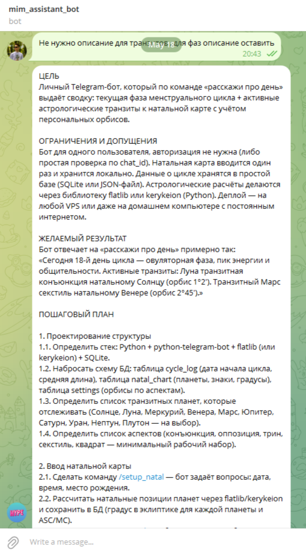
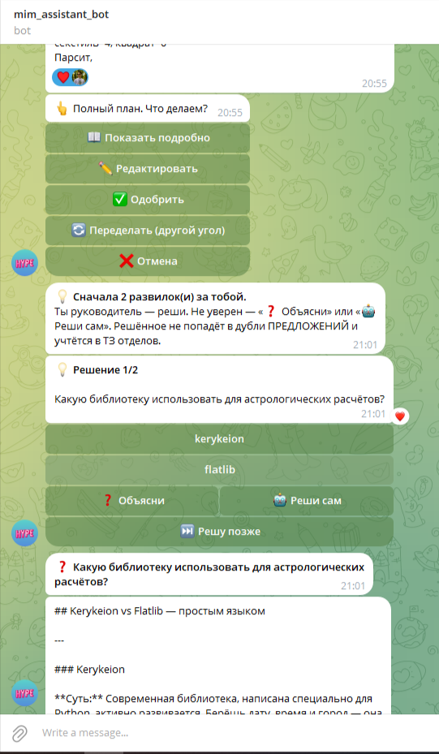
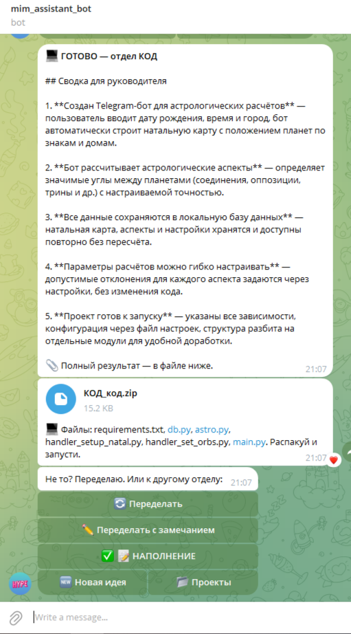

# idea-to-code-bot

> Личный AI-ассистент в Telegram: превращает идею в готовый код через Claude API.

Бросаешь идею в свободной форме — бот строит план, задаёт уточняющие вопросы кнопками, разносит работу по «отделам» (КОД / ДИЗАЙН / МУЗЫКА / НАПОЛНЕНИЕ), и каждый отдел исполняет через Claude. На выходе — ZIP с рабочим кодом или брифом.

Сделано как личный инструмент, end-to-end проверено: идея «змейка с неоном и рекордами» → сгенерированный `main.py` → собранный `.exe` за один проход.

---

## ⚡ Демо

**1. План с разносом по отделам**



**2. Развилка с кнопками выбора (или «Реши сам»)**



**3. Результат отдела КОД — ZIP с готовыми файлами**



---

## 🎯 Что умеет

- **Идея → структурированный план** в два слоя: краткий обзор + детальный (по кнопке)
- **Точечные правки плана** через текст («убери пункт 3.2», «в 1.1 замени Х на Y»)
- **Развилки решений** — модель находит места где нужен выбор, бот спрашивает кнопками:
  - `❓ Объясни` — модель объясняет варианты простыми словами
  - `🤖 Реши сам` — бот выбирает за пользователя и обосновывает
- **Разнос плана по отделам** с учётом принятых решений (не дублирует решённое)
- **Исполнение отдела** через Claude → файл результата:
  - Для КОДа — парсинг \`\`\`-блоков, сборка ZIP с реальными файлами
  - Для остальных — `<ОТДЕЛ>_РЕЗУЛЬТАТ.md`
- **Переделать с замечанием** — кнопка под результатом → текст правки → повторное исполнение
- **Менеджер проектов** — каждая идея = папка `projects/<дата>_<идея>/`, переключение через `/projects`

---

## 🛠️ Стек

| Слой | Технология |
|---|---|
| Язык | Python 3.14 |
| Telegram | [aiogram 3.28](https://github.com/aiogram/aiogram) (async) |
| LLM | Claude API через [proxyapi.ru](https://proxyapi.ru) (Anthropic SDK с подменой `base_url`) |
| Состояние | FSM (MemoryStorage) + кнопки-команды для устойчивости |
| Прокси | `aiohttp-socks` (для случая VPN с локальным HTTP-портом) |

Зависимости — в [`requirements.txt`](requirements.txt). Системные промпты вынесены в константы `PLAN_SYSTEM` / `EXEC_ROLES` в [`bot.py`](bot.py) — правки тона модели делаются там.

---

## 🏗️ Архитектура

```
Идея пользователя
      ↓
generate_plan()     → обзор + полный план
      ↓
extract_decisions() → опрос по развилкам (если есть)
      ↓
categorize_plan()   → разнос по отделам с учётом решений
      ↓
save_project()      → projects/<дата>_<идея>/{ИДЕЯ,ПЛАН,РЕШЕНИЯ,КОД,ДИЗАЙН,...}.md
      ↓
execute_department() по кнопке → Claude → файл/ZIP результата
      ↓
summarize_result()  → короткая сводка в чат + полный результат файлом
```

Весь LLM-слой изолирован в отдельных функциях — хендлеры/FSM/кнопки про модель ничего не знают, можно подменить провайдера без правок UI.

---

## 🚀 Запуск

```powershell
# 1. Виртуальное окружение
python -m venv venv
.\venv\Scripts\Activate.ps1

# 2. Зависимости
pip install -r requirements.txt

# 3. .env с токенами
# BOT_TOKEN=...               # от @BotFather
# PROXYAPI_KEY=...             # от proxyapi.ru
# CLAUDE_MODEL=claude-sonnet-4-6
# PROXY_URL=                   # пусто если VPN в режиме TUN

# 4. Запуск
.\venv\Scripts\python.exe bot.py
```

В логе должно появиться `Run polling for bot @<имя>`.

---

## ⚠️ Решённые проблемы

Реальные грабли, на которые я наступал — оставляю как памятку и как часть документации (это и было самым сложным):

**1. Telegram API недоступен с РФ-IP напрямую**
Решение: VPN в режиме TUN (заворачивает весь трафик ОС). При TUN — `PROXY_URL` в `.env` оставляем пустым, бот ходит «напрямую», VPN заворачивает прозрачно. Fallback — v2RayTun с локальным HTTP-портом + `aiohttp-socks` для aiogram.

**2. Anthropic не принимает российские карты**
Решение: [proxyapi.ru](https://proxyapi.ru) — посредник с тем же форматом API. Подмена `base_url="https://api.proxyapi.ru/anthropic"` в официальном SDK `anthropic`. Работает с РФ-IP без VPN.

**3. FSM теряется при рестарте бота (MemoryStorage)**
Решение: ключевые действия (`/projects`, `Новая идея`, переключение между проектами) сделаны как кнопки-команды БЕЗ фильтра состояния — работают всегда, в т.ч. после рестарта. `cb_stale` ловит «зависшие» кнопки от старой сессии и не даёт им сломать поток.

**4. Исполнение кода жжёт `max_tokens=20000` — баланс быстро уходит в HTTP 402**
Решение: бот ловит ошибки API и возвращает их текстом, не падает. Пользователю видно «закончился баланс», план не теряется, можно пополнить и повторить исполнение.

**5. `pygame` не собирается на Python 3.14**
Решение для генерируемого кода: использовать `pygame-ce` (community edition). В системном промпте КОДа явно прописано использовать его.

---

## 📂 Структура

```
.
├── bot.py                  # вся логика бота в одном файле
├── requirements.txt
├── .env.example            # шаблон переменных окружения
├── docs/screenshots/       # для README
├── projects/               # сгенерированные проекты (gitignored)
└── README.md
```

---

## 📜 Лицензия

MIT — делайте что хотите, ссылка приветствуется.
